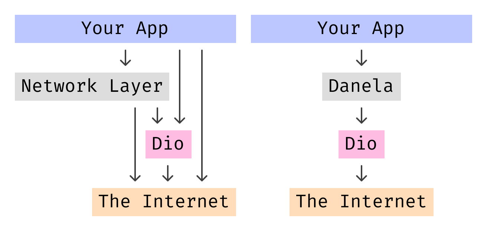

<!-- 
This README describes the package. If you publish this package to pub.dev,
this README's contents appear on the landing page for your package.

For information about how to write a good package README, see the guide for
[writing package pages](https://dart.dev/tools/pub/writing-package-pages). 

For general information about developing packages, see the Dart guide for
[creating packages](https://dart.dev/guides/libraries/create-packages)
and the Flutter guide for
[developing packages and plugins](https://flutter.dev/to/develop-packages). 
-->

Have you ever felt despair when it was time to integrate your app with yet another RESTful API?
This meant writing more boilerplate by creating new `ApiManager`s and `ApiRepositorie`s calling same Dio or Http methods over again.

**Danela** (**D**art **A**bstract **Ne**twork **La**yer) encapsulates the network layer logic providing a modular, customizable, efficient, and intuitive solution. Move from the boilerplate and legacy mess to the general approach.



Danela, the approach, and this image was inspired by [Moya](https://github.com/Moya/Moya).

## Installation

```yaml
# pubspec.yaml
dependencies:
  danela: ^1.0.0
```

## Usage

Danela operates with two data types. They do nothing but define the characteristics of an action. You can compare them to the Flutter widgets that act as a blueprint for the actual UI.
- `Request`s describe the action of requesting something from the Internet.
- `RequestMapper`s describe the way raw response data is processed and mapped to the outcoming model/

As for the actions over data types, there are also two concepts:
- `Gateway` is an interface for an object performing requests.
- `Repository` is an interface for an object caching or storing the data gateways provide it with.

```dart
// Create a request to the Joke API
final request = const Request(
    url: 'https://official-joke-api.appspot.com/random_joke',
);

// Define a mapper producing a String from a Dio's Response (since we are using Dio here)
final mapper = RequestMapper<Response, String>(
    mapJson: Joke.fromJson,
    onError: parseError,
);

// Create the Dio instance
final dio = Dio();

// Now we define the Gateway
final gateway = DioGateway(
    dio: dio,
    request: request,
    mapper: mapper,
);

// Safely fetch the String result
print(await gateway.run());

// Now, let's add caching 
final repository = DefaultRepository(gateway: gateway);

// We're good! Cache usage is set to true by default in the DefaultRepository
print(await repository.run(useCache: true));
```

## Using [`fpdart`](https://pub.dev/packages/fpdart)

If you're a functional programming approach enjoyer, leverage its beauty and conciseness easily with Danela.

```dart
// Use a mapper with Either
final mapper = RequestMapper<Response, Either<String, Joke>>(
    mapJson: (json) => Either.of(Joke.fromJson(json)),
    onError: (e) => '$e',
);

// Define the gateway as usual
final gateway = DioGateway(
    dio: dio,
    request: request,
    mapper: mapper,
);

// Wrap the run with a TaskEither 
final gatewayTask = TaskEither(gateway.run);

// Or define a local extension to transform a Future to the Task
extension GatewayToTaskExt<T> on Gateway<T> {
    Task<T> get toTask => Task(run);
}
```

## Testing

Danela is composable, so feel free to implement a `MockGateway` or `MockRepository` and inject it as a repository in your modules.

```dart
class MockRepository<T> implements Repository<T> {
    @override
    Future<T> run() => Future.delayed(
        const Duration(seconds: 2), 
        () => Random().nextInt(5),
    );
    
    @override
    void dispose() {}
}
```

## Contacts

The package is in developmen, so in case of problems or wishes to improve the project, feel free to create an issue on [GitHub](https://github.com/xdkomel/danela) or contact me on [Telegram](https://t.me/xdkomel).
